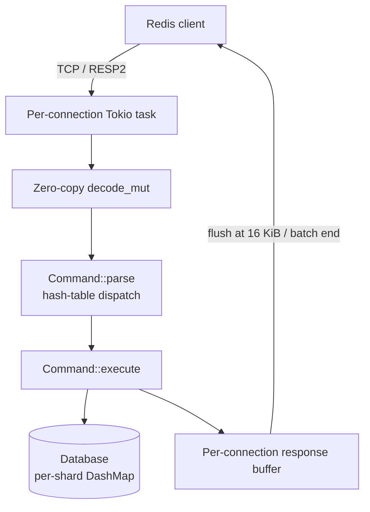

# Rudis

[](https://www.rust-lang.org/)
[](LICENSE)
[](https://github.com/Yoimiya-Naganohara/rudis/actions/workflows/ci.yml)

A Redis-compatible in-memory data store in Rust: multi-threaded Tokio runtime, zero-copy RESP decoding, allocation-free response formatting, and a DashMap-sharded store. Outperforms Valkey in every benchmark — see [Performance](#performance).

## Quick Start

```bash
git clone https://github.com/Yoimiya-Naganohara/rudis.git
cd rudis
cargo run --release          # listens on 127.0.0.1:6379
```

## Performance

Same machine (16-core WSL2), real TCP client with per-reply content verification, persistence disabled. Rudis runs the optimized build — `lto = "fat"`, `codegen-units = 1`, mimalloc, `target-cpu=native` — A/B verified +27–52% on mid-concurrency GET.

| Load | Command | **Rudis** | Garnet 2.1.1 | Valkey 9.0.5 |
|---|---|---|---|---|
| 1×500 | GET | 2.53M | **3.23M** | 2.17M |
| 16×16 | GET | **3.53M** | 1.77M | 1.83M |
| 50×100 | GET | **13.7M** | 3.79M | 2.97M |
| 50×100 | SET | 16.2M | **17.4M** | 2.15M |
| 50×100 | HSET | **13.6M** | 9.7M | 2.22M |
| 100×200 | GET | 19.9M | **32.8M** | 2.99M |
| 100×200 | SET | **21.2M** | 26.9M | 2.27M |
| 100×200 | HSET | 15.5M | **23.4M** | — |
| 200×250 | GET | 21.4M | **29.2M** | — |
| 200×250 | SET | **19.0M** | 3.41M† | — |
| 200×250 | HSET | **16.4M** | 3.46M† | — |

† Garnet figures are medians of multiple runs: GC pauses swing them up to 7× (its 3.4M write outliers above are the low end), while Rudis reproduces within ~3%. Valkey runs at its optimum — `io-threads` makes it *slower* on this machine. `valkey-benchmark` is not used: its single-threaded client caps ~9M req/s and underreports Rudis.

Rudis scales with connections (2.5M → 23.3M); Valkey's single-threaded loop tops out at 2–3M.

Reproduce: `cargo build --release --example bench_client && target/release/examples/bench_client 127.0.0.1:6379 50 100 1000000 get`

## Architecture



`src/networking/` connection loop · `src/commands/` dispatch + handlers · `src/database/` sharded store · `src/data_structures/` data types · `src/persistence/` RDB stub (not wired in)

## Development

```bash
cargo test          # unit + integration
cargo bench         # criterion benchmarks
cargo fmt && cargo clippy
```

## Known Limitations

- No `CONFIG GET`/`SET` — client libraries probe for these
- Persistence is a stub; in-memory only
- `SADD`/`ZADD` return `0` instead of `WRONGTYPE` on type mismatch
- Expiration is passive — expired keys are cleaned only when accessed
- `ZRANK` is O(n); small hashes are plain `HashMap`s

## License

MIT — see [LICENSE](LICENSE). Roadmap: [TODO.md](TODO.md).
