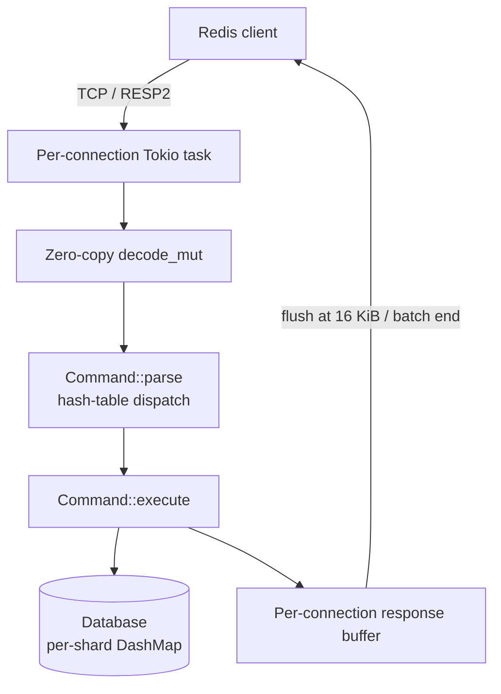

# Rudis

[](https://www.rust-lang.org/)
[](LICENSE)
[](https://github.com/Yoimiya-Naganohara/rudis/actions/workflows/ci.yml)

A Redis-compatible in-memory data store written in Rust, built on a multi-threaded Tokio runtime with zero-copy RESP decoding.

**Key numbers** (16-core WSL2, real TCP client, per-reply content verification):

| | Rudis | Garnet 2.1.1 | Valkey 9.0.5 |
|---|---|---|---|
| GET (100 conns × 200 pipeline) | 23.3M req/s | **32.8M** | 2.99M |
| SET (50 conns × 100 pipeline) | 15.1M req/s | **17.4M** | 2.15M |
| HSET (50 conns × 100 pipeline) | **13.4M req/s** | 9.7M | 2.22M |

Rudis beats Valkey in every test point; against Garnet it wins the low/mid-concurrency points while Garnet's .NET lock-free read path and log-structured writes win deep-pipeline/high-concurrency loads; see [Performance](#performance).

## Features

- **Zero-copy RESP parsing** — bulk strings are refcounted slices of the receive buffer, no per-frame copying (`redis-protocol` `decode-mut`)
- **Allocation-free response path** — replies are formatted directly into the connection's output buffer
- **Sharded data store** — `DashMap` with per-shard locks; reads run in parallel across worker threads
- **Pipelining** — batches of pipelined commands are decoded and executed in one pass with buffered, threshold-flushed replies
- **Data structures** — strings, lists, hashes, sets, sorted sets, with expiration (`EXPIRE`/`TTL`)
- **Concurrent** — one Tokio task per connection on a multi-threaded runtime
- **Rust safety** — memory safety guaranteed by the type system; no unsafe code in the server

## Quick Start

```bash
git clone https://github.com/Yoimiya-Naganohara/rudis.git
cd rudis
cargo run --release          # listens on 127.0.0.1:6379
```

Connect with any Redis client:

```bash
redis-cli -p 6379
```

```redis
SET key "Hello, Rudis!"
GET key
HSET myhash field1 "value1"
HGET myhash field1
LPUSH mylist "item1"
LPOP mylist
ZADD zset 1.5 member
ZRANGE zset 0 -1
```

## Supported Commands

### Connection
`PING` `QUIT` `ECHO` `AUTH` `SELECT` `INFO`

### Strings
`SET` (NX/XX/EX/PX/KEEPTTL) `GET` `SETNX` `SETEX` `GETSET` `MSET` `MGET` `INCR` `DECR` `INCRBY` `DECRBY` `APPEND` `STRLEN` `DEL`

### Hashes
`HSET` (multi-pair) `HGET` `HGETALL` `HDEL` `HKEYS` `HVALS` `HLEN` `HEXISTS` `HINCRBY` `HINCRBYFLOAT`

### Lists
`LPUSH` `RPUSH` `LPOP` `RPOP` `LLEN` `LINDEX` `LRANGE` `LTRIM` `LSET` `LINSERT`

### Sets
`SADD` `SREM` `SMEMBERS` `SCARD` `SISMEMBER` `SINTER` `SUNION` `SDIFF`

### Sorted Sets
`ZADD` (Redis added-count semantics) `ZRANGE` `ZRANGEBYSCORE` `ZREM` `ZCARD` `ZSCORE` `ZRANK`

### Keys
`EXISTS` `EXPIRE` `TTL` `TYPE` `KEYS` `FLUSHALL` `FLUSHDB`

Missing commands are tracked in [TODO.md](TODO.md).

## Performance

### Methodology

- Same machine (16-core, WSL2); persistence disabled on all servers
- **`bench_client`** (`examples/bench_client.rs`): independent Tokio load client — real TCP connections, RESP pipelining, and **per-reply content verification** (every GET must return the stored value, every SET must return `OK`)
- Load profiles: `conns × pipeline` per command, 0.5–1M requests
- Garnet v2.1.1 (pure in-memory, .NET 10); Valkey 9.0.5 (`--save "" --appendonly no`)
- `valkey-benchmark` is *not* used for Rudis numbers: its single-threaded client caps at ~9M req/s and underreports Rudis (cross-checked: it matches `bench_client` for Valkey within ~3%)

### Results (req/s)

```mermaid
---
config:
  themeVariables:
    xyChart:
      plotColorPalette: "#1f77b4, #ff7f0e, #2ca02c"
---
xychart-beta
    title "50 connections x 100 pipeline (req/s)"
    x-axis ["GET", "SET", "HSET"]
    y-axis "req/s" 0 --> 15000000
    bar [13900000, 15100000, 13400000]
    bar [3790000, 17400000, 9700000]
    bar [2970000, 2150000, 2220000]
```



*Bar series in declaration order: blue = Rudis, orange = Garnet, green = Valkey. (Requires a mermaid renderer with `xychart-beta` support, e.g. GitHub; older renderers fall back to the table below.)*

| Load | Command | **Rudis** | Garnet | Valkey |
|---|---|---|---|---|
| 1 conn × 500 | GET | 2.53M | **3.23M** | 2.17M |
| 16 × 16 | GET | **3.53M** | 1.77M | 1.83M |
| 50 × 100 | GET | **13.9M** | 3.79M | 2.97M |
| 50 × 100 | SET | 15.1M | **17.4M** | 2.15M |
| 50 × 100 | HSET | **13.4M** | 9.7M | 2.22M |
| 100 × 200 | GET | 23.3M | **32.8M** | 2.99M |
| 100 × 200 | SET | 19.0M | **26.9M** | 2.27M |
| 100 × 200 | HSET | 15.5M | **23.4M** | — |
| 200 × 250 | GET | 21.4M | **29.2M** | — |
| 200 × 250 | SET | **19.0M** | 3.41M* | — |
| 200 × 250 | HSET | **16.4M** | 3.46M* | — |

*Garnet results are medians of multiple runs — it fluctuates wildly (GC pauses, up to 7x between runs), while Rudis reproduces within ~3%. The 200×250 write outliers (3.4M) show the low end of that fluctuation; its write medians at 50×100 (17.4M SET, 9.7M HSET) are the reliable figures. Valkey is at its optimum: `io-threads` on this WSL2 machine makes it *slower*. Rudis numbers use the `[profile.release] lto = "fat", codegen-units = 1` build.

### Reading the numbers

- **Rudis scales with connection count** — from 2.5M (single connection, round-trip bound) to 23.3M at 100×200 — while Valkey's single-threaded event loop tops out at 2–3M in every profile (enabling `io-threads` made Valkey *slower* on this WSL2 machine)
- **Garnet wins the high-concurrency points** (100×200 GET +41%, SET +42%, 200×250 GET +36%): its lock-free read path and log-structured writes shine once enough requests are in flight. But it needs that in-flight depth — at 50×100 it manages only 3.79M GET (vs Rudis 13.9M) — and it is highly unstable run-to-run
- **Rudis wins the low/mid-concurrency points** (16×16 GET, 50×100 GET/HSET) and is the most consistent server of the three; the LTO release build added 6–27% over the default profile
- All benchmarks include full reply-content verification, so the numbers carry correctness backing

### Reproduce

```bash
# Build the load client
cargo build --release --example bench_client

# Rudis
cargo run --release &

# 50 connections × 100 pipeline, 1M GETs with content verification
target/release/examples/bench_client 127.0.0.1:6379 50 100 1000000 get
target/release/examples/bench_client 127.0.0.1:6379 50 100 1000000 set
target/release/examples/bench_client 127.0.0.1:6379 50 100 1000000 hset
```

## Architecture



- **Networking** (`src/networking/`) — one task per connection; reads up to 64 KiB per cycle, decodes every complete frame without copying, executes, and flushes buffered replies
- **Commands** (`src/commands/`) — case-insensitive hash-table dispatch (`COMMAND_TABLE`), handlers write responses straight into the connection's buffer
- **Database** (`src/database/`) — 16 logical databases, each a `DashMap<Bytes, RedisValue>`; `AtomicU8` index, no global lock on the hot path
- **Data structures** (`src/data_structures/`) — `RedisString`, `RedisList` (`VecDeque`), `RedisHash` (`HashMap`), `RedisSet` (`HashSet`), `RedisSortedSet` (`HashMap` + `BTreeSet` with score ordering)

## Project Structure

```
src/
├── main.rs            # entry point
├── config/            # server config (hard-coded defaults)
├── networking/        # TCP accept loop, per-connection handler, RESP
├── commands/          # command enum, dispatch table, per-type handlers
├── database/          # sharded in-memory store, trait implementations
├── data_structures/   # RedisString, RedisList, RedisHash, RedisSet, RedisSortedSet
├── persistence/       # RDB snapshot stub (not wired in yet)
└── server/            # server assembly

examples/
└── bench_client.rs    # independent load-test client (real TCP + RESP)

benches/
└── redis_benchmark.rs # criterion benchmarks (parse, per-command, stress)

tests/                 # integration + unit tests (38 tests)
```

## Development

```bash
cargo build             # build
cargo test              # run all tests (38 tests)
cargo bench             # criterion benchmarks
cargo fmt               # format
cargo clippy            # lint
```

Test coverage: command parsing/dispatch, all data structures (including sorted-set semantics, NaN score rejection, tie-breaking), type-conflict errors, and database edge cases.

## Known Limitations

- **No `CONFIG GET`/`SET`** — client libraries and `valkey-benchmark` probe for it (hence the "Could not fetch server CONFIG" warning)
- **Persistence is a stub** — RDB/AOF are on the roadmap, not implemented; the server is in-memory only
- **`SADD`/`ZADD` return `0` instead of `WRONGTYPE`** on type mismatch (trait signatures return `usize`)
- **Expiration is passive** — expired keys are only cleaned when accessed
- `zrank` is O(n); small hashes are plain `HashMap`s (no listpack-style encoding yet)

## Roadmap

See [TODO.md](TODO.md) for planned features, including persistence, transactions, Pub/Sub, and remaining commands.

## Contributing

1. Fork the repository
2. Create a feature branch (`git checkout -b feature/amazing-feature`)
3. Commit your changes (`git commit -m 'Add some amazing feature'`)
4. Push to the branch (`git push origin feature/amazing-feature`)
5. Open a Pull Request

Guidelines: follow the existing module structure, add tests for new features, and ensure `cargo fmt`, `cargo clippy`, and `cargo test` all pass.

## License

MIT — see the [LICENSE](LICENSE) file.
