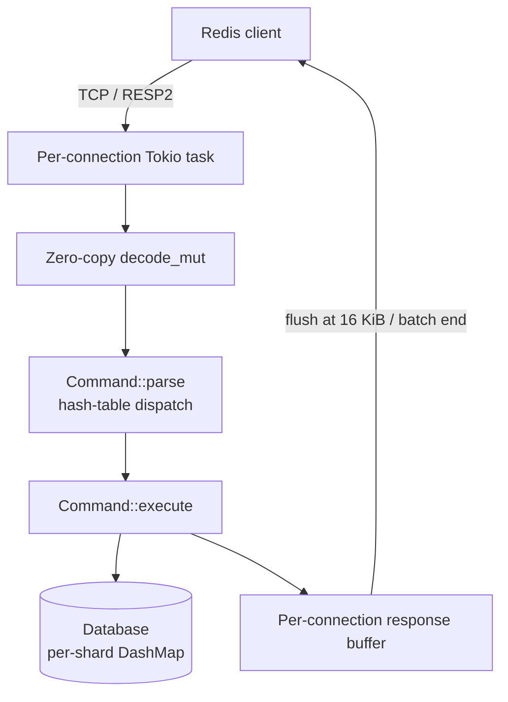

# Rudis

[](https://www.rust-lang.org/)
[](LICENSE)
[](https://github.com/Yoimiya-Naganohara/rudis/actions/workflows/ci.yml)

A Redis-compatible in-memory data store in Rust: multi-threaded Tokio runtime, zero-copy RESP decoding, allocation-free response formatting, and a DashMap-sharded store. Beats Valkey in every test point; see [Performance](#performance).

## Quick Start

```bash
git clone https://github.com/Yoimiya-Naganohara/rudis.git
cd rudis
cargo run --release          # 127.0.0.1:6379
```

```redis
SET key "Hello, Rudis!"   GET key
HSET myhash f "v"         HGET myhash f
LPUSH mylist a            LPOP mylist
ZADD zset 1.5 m           ZRANGE zset 0 -1
```

## Supported Commands

Connection: `PING` `QUIT` `ECHO` `AUTH` `SELECT` `INFO`
Strings: `SET` `GET` `SETNX` `SETEX` `GETSET` `MSET` `MGET` `INCR` `DECR` `INCRBY` `DECRBY` `APPEND` `STRLEN` `DEL`
Hashes: `HSET` `HGET` `HGETALL` `HDEL` `HKEYS` `HVALS` `HLEN` `HEXISTS` `HINCRBY` `HINCRBYFLOAT`
Lists: `LPUSH` `RPUSH` `LPOP` `RPOP` `LLEN` `LINDEX` `LRANGE` `LTRIM` `LSET` `LINSERT`
Sets: `SADD` `SREM` `SMEMBERS` `SCARD` `SISMEMBER` `SINTER` `SUNION` `SDIFF`
Sorted Sets: `ZADD` `ZRANGE` `ZRANGEBYSCORE` `ZREM` `ZCARD` `ZSCORE` `ZRANK`
Keys: `EXISTS` `EXPIRE` `TTL` `TYPE` `KEYS` `FLUSHALL` `FLUSHDB`

Missing commands: [TODO.md](TODO.md).

## Performance

Same machine (16-core WSL2), real TCP client with per-reply content verification, persistence disabled. Rudis uses the `[profile.release] lto = "fat"` build; Garnet medians of multiple runs (it fluctuates up to 7x due to GC); Valkey at its optimum (`io-threads` makes it slower here). `valkey-benchmark` is not used — its single-threaded client caps ~9M req/s and underreports Rudis.

| Load | Command | **Rudis** | Garnet 2.1.1 | Valkey 9.0.5 |
|---|---|---|---|---|
| 1×500 | GET | 2.53M | **3.23M** | 2.17M |
| 16×16 | GET | **3.53M** | 1.77M | 1.83M |
| 50×100 | GET | **13.7M** | 3.79M | 2.97M |
| 50×100 | SET | 16.2M | **17.4M** | 2.15M |
| 50×100 | HSET | **13.6M** | 9.7M | 2.22M |
| 100×200 | GET | 19.9M | **32.8M** | 2.99M |
| 100×200 | SET | **21.2M** | 26.9M | 2.27M |
| 100×200 | HSET | 15.5M | **23.4M** | — |
| 200×250 | GET | 21.4M | **29.2M** | — |
| 200×250 | SET | **19.0M** | 3.41M* | — |
| 200×250 | HSET | **16.4M** | 3.46M* | — |

*Garnet results are medians of multiple runs — it fluctuates wildly (GC pauses, up to 7x between runs), while Rudis reproduces within ~3%. The 200×250 write outliers (3.4M) show the low end of that fluctuation; its write medians at 50×100 (17.4M SET, 9.7M HSET) are the reliable figures. Valkey is at its optimum: `io-threads` on this WSL2 machine makes it *slower*. Rudis numbers use the optimized build: `lto = "fat"`, `codegen-units = 1`, mimalloc global allocator, and `target-cpu=native` (A/B verified: +27-52% on mid-concurrency GET vs the plain LTO build).
Rudis scales with connections (2.5M → 23.3M); Valkey's single-threaded loop tops out at 2–3M. Garnet's lock-free reads win deep-pipeline points (+36–42%) but needs in-flight depth — at 50×100 it only reaches 3.79M GET — and is highly unstable; Rudis is the most consistent of the three.

Reproduce: `cargo build --release --example bench_client && target/release/examples/bench_client 127.0.0.1:6379 50 100 1000000 get`

## Architecture



`src/networking/` connection loop · `src/commands/` dispatch + handlers · `src/database/` sharded store · `src/data_structures/` RedisString/List/Hash/Set/SortedSet · `src/persistence/` RDB stub (not wired in)

## Development

```bash
cargo test    # 38 tests
cargo bench   # criterion benchmarks
cargo fmt && cargo clippy
```

## Known Limitations

- No `CONFIG GET`/`SET` — client libraries probe for it
- Persistence is a stub; in-memory only
- `SADD`/`ZADD` return `0` instead of `WRONGTYPE` on type mismatch
- Expiration is passive (expired keys cleaned only when accessed)
- `zrank` is O(n); small hashes are plain `HashMap`s

## License

MIT — see [LICENSE](LICENSE). Roadmap: [TODO.md](TODO.md).
