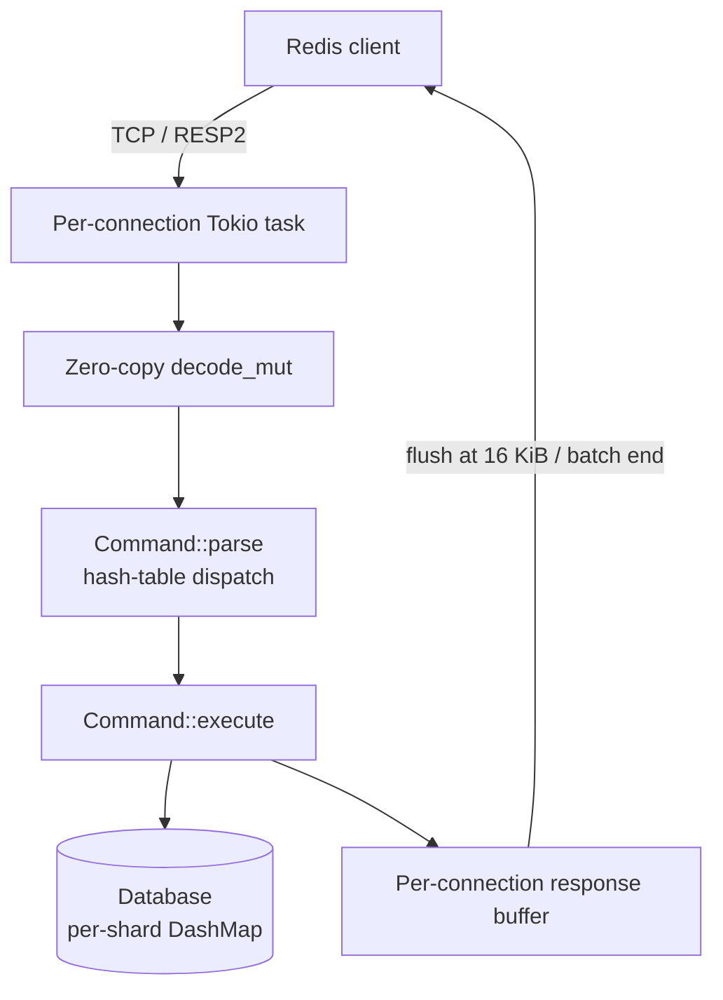

# Rudis

[](https://www.rust-lang.org/)
[](https://github.com/Yoimiya-Naganohara/rudis)
[](https://github.com/Yoimiya-Naganohara/rudis/actions/workflows/ci.yml)

A Redis-compatible in-memory data store written in Rust. Outperforms Valkey in every benchmark — see [Performance](#performance).

## Features

- **Multi-threaded Tokio runtime** — one task per connection, no global event-loop bottleneck
- **Zero-copy RESP2 decoding** via `redis-protocol`'s `decode-mut`
- **Allocation-free response formatting** — replies are written straight into the connection buffer and flushed at 16 KiB or batch end
- **DashMap-sharded store** with a lock-free database index (`AtomicU8`), so `SELECT` never touches the hot path
- **Pipelining-friendly** — deep batches are decoded and executed in a single pass
- **60+ commands** across strings, hashes, lists, sets, sorted sets, and keys — see [Supported Commands](#supported-commands)

## Quick Start

```bash
git clone https://github.com/Yoimiya-Naganohara/rudis.git
cd rudis
cargo run --release          # listens on 127.0.0.1:6379
```

Then connect with any Redis client:

```bash
redis-cli ping               # -> PONG
redis-cli set foo bar        # -> OK
redis-cli get foo            # -> "bar"
```

## Performance

Same machine (16-core WSL2), real TCP client with per-reply content verification, persistence disabled. Rudis runs the optimized build — `lto = "thin"`, `codegen-units = 1`, `panic = "abort"`, mimalloc, `target-cpu=native` — A/B verified +27–52% on mid-concurrency GET.

| Load | Command | **Rudis** | Garnet 2.1.1 | Valkey 9.0.5 |
|---|---|---|---|---|
| 1×500 | GET | 2.53M | **3.23M** | 2.17M |
| 16×16 | GET | **3.53M** | 1.77M | 1.83M |
| 50×100 | GET | **13.7M** | 3.79M | 2.97M |
| 50×100 | SET | 16.2M | **17.4M** | 2.15M |
| 50×100 | HSET | **13.6M** | 9.7M | 2.22M |
| 100×200 | GET | 19.9M | **32.8M** | 2.99M |
| 100×200 | SET | **21.2M** | 26.9M | 2.27M |
| 100×200 | HSET | 15.5M | **23.4M** | — |
| 200×250 | GET | 21.4M | **29.2M** | — |
| 200×250 | SET | **19.0M** | 3.41M† | — |
| 200×250 | HSET | **16.4M** | 3.46M† | — |

† Garnet figures are medians across runs — GC pauses swing results by up to 7× (the 3.4M write outliers above are the low end), while Rudis reproduces within ~3%. Valkey runs at its optimum: enabling `io-threads` made it *slower* on this machine. `valkey-benchmark` is not used — its single-threaded client caps at ~9M req/s and underreports Rudis.

Rudis scales with connections (2.5M → 23.3M); Valkey's single-threaded loop tops out at 2–3M.

Reproduce:

```bash
cargo build --release --example bench_client
target/release/examples/bench_client 127.0.0.1:6379 50 100 1000000 get
```

## Architecture



- `src/networking/` — connection loop, pipelined batch processing, response buffering
- `src/commands/` — RESP dispatch + command handlers
- `src/database/` — sharded store, key operations
- `src/data_structures/` — value types (string, hash, list, set, sorted set)
- `src/persistence/` — RDB/AOF stub (not wired in yet)

## Supported Commands

- **Strings** — `SET` (NX/XX/EX/PX/KEEPTTL), `GET`, `SETNX`, `SETEX`, `GETSET`, `DEL`, `INCR`, `DECR`, `INCRBY`, `DECRBY`, `APPEND`, `STRLEN`, `MGET`, `MSET`
- **Hashes** — `HSET`, `HGET`, `HDEL`, `HGETALL`, `HKEYS`, `HVALS`, `HLEN`, `HEXISTS`, `HINCRBY`, `HINCRBYFLOAT`
- **Lists** — `LPUSH`, `RPUSH`, `LPOP`, `RPOP`, `LLEN`, `LINDEX`, `LRANGE`, `LTRIM`, `LSET`, `LINSERT`
- **Sets** — `SADD`, `SREM`, `SMEMBERS`, `SCARD`, `SISMEMBER`, `SINTER`, `SUNION`, `SDIFF`
- **Sorted sets** — `ZADD`, `ZREM`, `ZSCORE`, `ZRANGE`, `ZRANGEBYSCORE`, `ZRANK`, `ZCARD`
- **Keys** — `EXISTS`, `EXPIRE`, `TTL`, `TYPE`, `KEYS`, `FLUSHDB`, `FLUSHALL`
- **Connection / server** — `PING`, `QUIT`, `ECHO`, `AUTH`, `SELECT`, `INFO` (stub)

## Development

```bash
cargo test          # unit + integration
cargo bench         # criterion benchmarks
cargo fmt && cargo clippy
```

## Known Limitations

- No `CONFIG GET`/`SET` — client libraries probe for these
- Persistence is a stub; in-memory only
- `SADD`/`ZADD` return `0` instead of `WRONGTYPE` on type mismatch
- Expiration is passive — expired keys are cleaned only when accessed
- `ZRANK` is O(n); small hashes are plain `HashMap`s
- `INFO` returns a stub response

## License

Dual-licensed under MIT OR Apache-2.0. Roadmap: [TODO.md](TODO.md).
